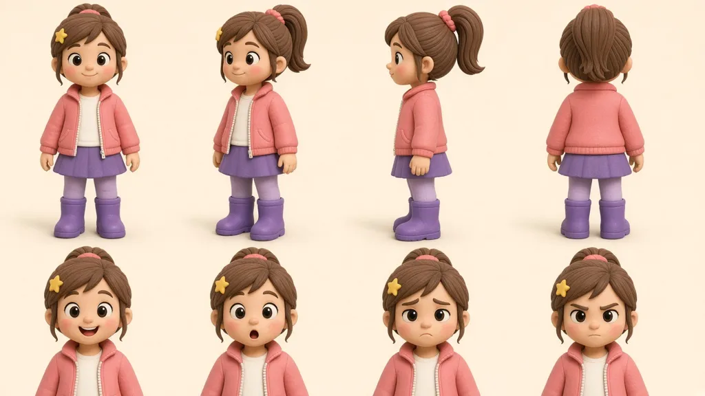
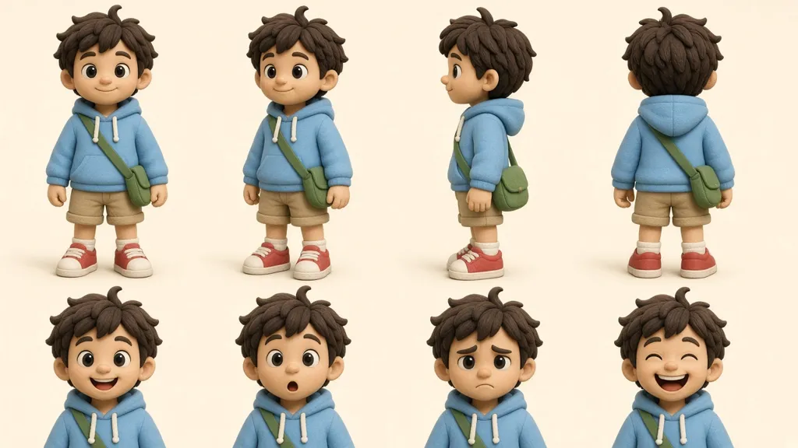
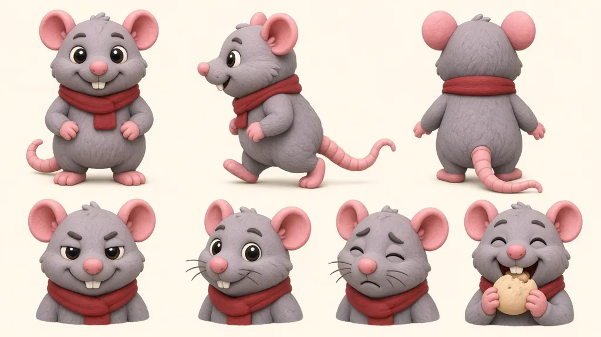
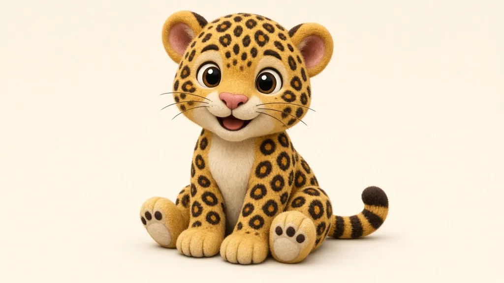
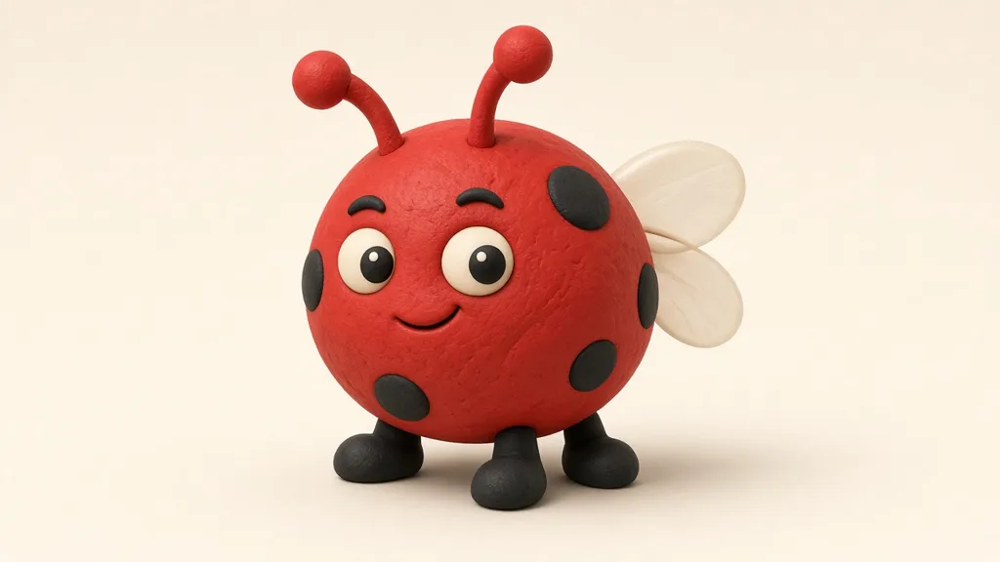
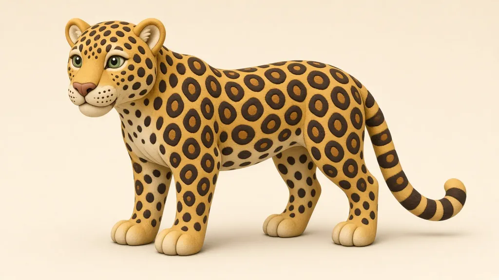

# 角色设定

画新页、改页时以本页设定和角色表为准。角色表是每一页的参考图，不是故事内插图。

---

## Flag in the Fog

## 一致性规则

- **主角固定**：本故事主角是米娅（Mia），本（Ben）是固定配角，老鼠（Rat）是软反派。
- **外形不换**：发型、发色、身材、服装除非剧情明确要求，否则每一页都保持同一套。
- **角色表即参考**：`docs/characters/mia.webp`、`ben.webp`、`rat.webp` 用于对照每一页，不要凭记忆改衣服或脸型。

## 米娅 Mia（主角）

- 棕色高马尾，粉色发圈；左侧夹一枚黄色星星发夹
- 珊瑚粉拉链外套，内搭白 T
- 短紫色裙子、淡紫色打底裤、紫色雨靴

## 本 Ben（固定配角）

- 棕色乱发，头顶一撮翘发
- 天蓝连帽衫、卡其短裤、白袜、红运动鞋
- 斜挎绿色布包（老鼠在 P08 偷走，P18 还回）

## 老鼠 Rat（软反派）

- 圆滚滚的灰色、大大的粉耳朵
- 粉鼻子、粉尾巴、红围巾

## 画图提示前缀（Flag in the Fog）

生成或重绘故事页时，提示词以这句开头，再写具体构图：

`Children's storybook full-bleed, outlined soft clay.`

白天、光线明亮、画面里不要出现文字。

场景走向：海盗湾海滩 → 薄雾 → 小山脚沙洞 → 回到海滩。

---

## Spot the Cub

本故事主角仍是米娅（Mia）和本（Ben），外形与 Flag in the Fog 角色表相同。新角色：小豹（cub）、瓢虫朋友 Bug、豹妈妈（Mom Leopard）。

## 小豹 Cub

- 金黄色皮毛，口鼻、胸口和肚皮是奶油色
- 粉色鼻子、圆耳朵
- 身上有和豹妈妈一样的玫瑰斑（rosette）
- 尾巴深棕、一圈一圈的环纹

## 瓢虫 Bug（朋友）

- 小豹的瓢虫朋友，一路帮忙找妈妈
- 圆圆的红壳、黑点、细脚

## 豹妈妈 Mom Leopard

- 站立的成年豹子
- 玫瑰斑、奶油色口鼻与肚皮，和小豹同一家族外形

## 画图提示前缀（Spot the Cub）

`Children's storybook full-bleed, outlined soft clay.`

白天、光线明亮、画面里不要出现文字。

场景走向：森林 → 小溪圆木 → 林间空地 → 灌木 / 篱笆院子 → 高树梢 → 豹妈妈身边。

---

## A Lot of Dots!

本故事人类主角仍是米娅（Mia），外形与前两章角色表相同。本章专属角色：小狗 pup、粉色小猪 Figgy（菲吉）、橘色小猫 cat。本（Ben）和老鼠（Rat）不出现。

- **小狗 Pup**：白色，一只棕耳朵，蓝项圈，最爱一只红袜子；米娅自己的小狗
- **Figgy 菲吉**：粉色小猪，黄色蓬松假发；参赛选手
- **小猫 Cat**：真猫，橘色，戴大草帽；参赛选手

评委只画一只手，观众只画背影帽子，都不算角色。

## 画图提示前缀（A Lot of Dots!）

`Children's storybook full-bleed, outlined soft clay.`

白天、光线明亮、画面里不要出现文字。颜料只用红、粉、蓝；米娅衣服不沾颜料。

场景走向：山坡农场集市 → 三个画位（小床当画桌）→ 坡底小黄出租车旁 → 回到画位 → 评奖台。
